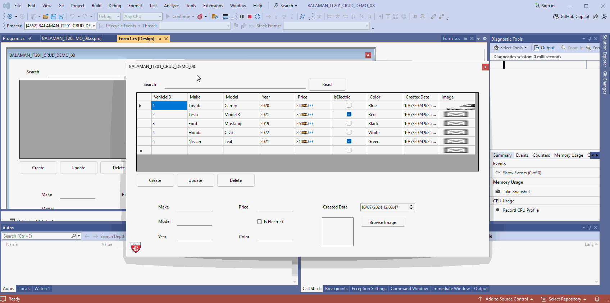

# CSharp_CRUD
Repository for CSharp CRUD Demo Item 08.

> This C# Windows Forms project implements a basic CRUD (Create, Read, Update, Delete)
application for managing vehicle records using a SQL Server database. The program allows users to add, view,
update, and delete vehicle data, which includes details like make, model, year, price, and electric status.

> It also allows users to upload and display vehicle images. The vehicle records are displayed in a DataGridView, 
and database interactions are managed using ADO.NET with SqlConnection and SqlCommand. The project features error 
handling and user feedback through message boxes.

#### Preview

### I. Prerequisites
- [ ] Visual Studio Community Edition (2019 or 2022). Ensure Visual Studio Community is installed, with .NET Desktop Development and SQL Server Data Tools.
- [ ] SQL Server Express (2019 or 2022). SQL Server Express must be installed to manage the database for the application.
- [ ] Administrator Access. Ensure you have administrator rights to make system changes (e.g., setting up databases and configuring Visual Studio).

### II.A Setup (Without Virtual Machine)
1. Download and Extract the Zip File. Obtain the project files and extract them on your local workstation.
2. Open Project in Visual Studio. Launch Visual Studio Community Edition and open the demo project.
3. Create a Database Connection. Establish a data connection to localhost\SQLExpress in SQL Server.
4. Insert Vehicle Data. Populate the database with vehicle information.
5. Update Connection String. Modify the Windows Form code to reflect the correct database connection string in the project.
6. Test CRUD Operations. Execute the project and ensure the Create, Read, Update, and Delete functionalities work as expected.

### II.B Setup (With Virtual Machine)
1. Launch VirtualBox. Open VirtualBox and start the virtual machine (VM).
2. Open Visual Studio Inside VM. In the VM, launch Visual Studio Community and open the CRUD Demo project.
3. Test CRUD Operations. Run the project and verify the CRUD functionalities within the virtual environment.

### III. Group Tasks
Each group must select at least 5 tasks and implement the necessary modifications to the project. After completing
the tasks, submit a PDF document as evidence, which includes a brief discussion of the updates your group made.

- [ ] **Task 3.1.1** - Implement a "Clear" Button for Input Fields. Add a button that clears all the input fields (txtMake, txtModel, etc.) 
so users can easily reset the form after adding or updating records.

- [ ] **Task 3.1.2** - Add Input Validation. Ensure fields like Year and Price only accept valid numbers, and mandatory fileds like Make and Model
are filled before allowing the record to be added.

- [ ] **Task 3.1.3** - Add Confirmation for Delete. Before deleting a record, display a confirmation dialog to ensure the user really wants to delete
the selected vehicle.

- [ ] **Task 3.1.4** - Add a Color Theme. Implement a consistent color theme for the entire form (background color, button colors, and text colors).
Allow users to switch between light and dark themes to improve the user interface experience.

- [ ] **Task 3.1.5** - Add an Application Icon. Update the form to include a custom icon in the title bar and taskbar, giving the application a more
polished and identifiable appearance.

- [ ] **Task 3.1.6** - Add a Background Image or Gradient. Apply a subtle background image or gradient to the form to improve its appearance, ensuring 
it does not distract from the functional elements of the application.

- [ ] **Task 3.1.7** - Add an "About Us" Page. Create a new Windows Form that serves as an "About Us" page displaying group member information, including 
lastname, firstname, a formal imagem email address, and role in the project. Ensure the page has a consistent layout and design, using
appropriate font sizes and component colors for a professional look. Add a "Back" button to return to the main form.

- [ ] **Task 3.1.8** - Add Vehicle Dimensions (mm) to the Database and Forms. Update the database table to include new fields for vehicle dimensions (length, width, height in millimeters).
Modify the Windows Form to allow input for these fields, and display them in the DataGridView. Ensure data validation (e.g., numeric input only).
For example, include dimensions such as 4,885 mm in length, 1,840 mm in width, and 1,445 mm in height for vehicle like the Toyota Camry.

- [ ] **Task 3.1.9** - Add Vehicle Weight (kg) to the Database and Form. Add a new column to the database table for vehicle weight in kilograms. Update the form to allow users to input the 
vehicle's weight and display this information in the DataGridView. Ensure validation is in place to allow only numerical values for weight input.

- [ ] **Task 3.1.10** - Add Number of Seaters to Vehicle Information. Introduce a new column in the database to store the number of seaters for each vehicle.
Modify the form to include a field where users can input the number of seats, and display this data in the DataGridView. Validate the input to ensure only reasonable
values (e.g., 2-8) are entered.

